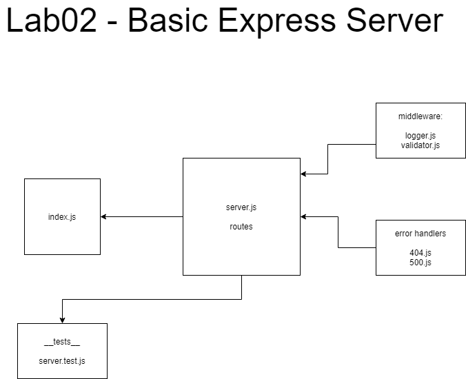

# cloud-server

## Description

Deploy a Node.js server to AWS EC2

## Feature Tasks

Deploy a simple Node.js server to EC2, using Elastic Beanstalk

## Author

Ayrat Gimranov

## Collaborator

Alex White (instructor)

## Version

1.2.1

## Resources

Code Feloows 401: JS demo code (Class 2) - <https://github.com/codefellows/seattle-javascript-401n19/tree/main/class-02>
Phil Murphy's Lab02 code - <https://github.com/phmurphy212/server-deployment-practice/blob/dev/__test__/server.test.js>

## Deployed Sites

- Task 1 deployed link: <http://cloudserver1nojest-env.eba-qgpbh9xb.eu-central-1.elasticbeanstalk.com/>
  - Create a new environment, using Elastic Beanstalk from the AWS Control Panel (GUI)
  - Manually deploy your application to this environment by uploading a .zip file

- Task 2 deployed link: <http://ebcli-envrinment.eba-yxerk2km.eu-central-1.elasticbeanstalk.com/>
  - Using the same server, create a new environment using Elastic Beanstalk from your terminal
  - Manually deploy your application to this environment by using eb deploy

## UML

;